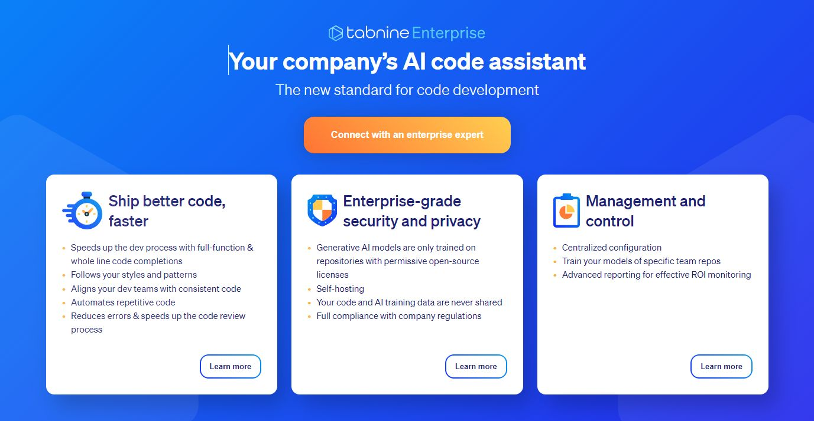

# Experiments with  ChatGPT, Copilot, and Midjourney

Jan Mayer - Jour Fixe 12.05.23

---

### Something new


- Cutting-edge technology
- Capable of understanding and generating
- Trained on vast amounts of data

<!--
- Assist with problem-solving and decision-making
- Enhance productivity and efficiency
-->

---

```txt
              +------+                      +------------+
              |      |  Text, Code, Images  |            |
              |      |  ----------------->  |    "AI"    |  Text, Code,
Project <---- | User |                      |            | <------------ ???
              |      |  <----------------   |  BlackBox  |     Images
              |      |  Text, Code, Images  |            |
              +------+                      +------------+
```

---

## Nothing new


1) Don't install random software or plugins
2) Be careful what you expose to the internet
3) Don't trust what you read on the internet
<!--
    - don't compromise customers' intellectual property
    - don't compromise your own intellectual property
    - don't compromise secrets
    - don't compromise yourself
-->
<!--
    - don't blindly trust the output
    - don't copy code on a large-scale
-->

<!-- The security cats have warned us of that since the dark ages -->

<!--
```txt
/imagine a security cat in medieval armor guarding a computer, photorealistic --v 5.1
```
-->

---

## Overview of AI Tools

---

## Images

<style scoped>{font-size: 30px;}</style>
| Name               | Functions                                          | Price                     | Free Tier      |
|-------------------:| -------------------------------------------------- | ------------------------- | -------------- |
| Midjourney         | Text-To-Image, Image-To-Text, Image-To-Image       | $10+/month              | Limited |
| Dall-E 2 (OpenAI)  | Text-To-Image, Inpainting, Outpainting, Variations | Usage-Based    | No (?)          |
| Stable Diffusion 2 | Text-To-Image, (Inpainting, Outpainting)           | Open-Source, Paid Hosting | Open-Source    |
| Leonardo AI        | Text-To-Image, Image-To-Image                      | n.A.              | Daily Limit |
<!-- https://docs.midjourney.com/docs/plans -->

---

## Midjourney Demo


---


---
<style scoped>{font-size: 30px;}</style>

## Video / Audio


| Name       | Functions     |
|-----------:| ------------- |
| ElevenLabs | Voice Cloning (Text-to-Speech) |
| Voice A.I. | Voice Cloning (Speech-to-Speech) |
| Soundraw   | Music         |
| Lumen 5    | Video         |

---

<style scoped>{font-size: 30px;}</style>

## In-Browser Chats ("Google++")

| Name                   | Modell                                  | Price | Free Tier |
|-----------------------:| --------------------------------------- | ----- | --------- |
| ChatGPT (OpenAI)       | GPT-3.5, GPT-4                          |  $20/month  | GPT3.5 + API Credits |
| Phind                  | "The AI search engine for developers."  |   -   | Free      |
| dalai / Alpaca         | LLaMa (Facebook) | - | complicated |
| Bard (Google)          | PaLM 2              | ??? | Probably Yes |
| Huggingface Models     | several pre-trained models              | depends | Yes |

---

## ChatGPT Demo


---

## Testimonials

> I don't need to google things as often [...] That makes me extremely efficient. I doubled the amount of code I'm producing over the same period of time. Even if is about 70% - 80% accurate, is our job to take care of the rest 20% - 30% isn't it?

<p class="small-text">Comment from Sizu on https://www.youtube.com/watch?v=C_teb93alL4</p>

---

## Testimonials

> The way I use ChatGPT for programming is to have it write a simple example of how to use a function or library for a specific task, and then use its answer as a reference, while also double checking things using documentation or Google.

<p class="small-text">Comment from Matthew on https://www.youtube.com/watch?v=C_teb93alL4</p>

---

## Testimonials

> I treat chatgpt as my very knowledgeable assistant. It helps me going in the right direction. There have been many times where it pointed me to a library, or a specific method in a library or framework, which I forgot about or just hadn't used before.

<p class="small-text">Comment from Moje Konto on https://www.youtube.com/watch?v=C_teb93alL4</p>

---

<style scoped>{font-size: 25px;}</style>

## In-Editor Coding Assistants ("IntelliJ++")

| Name                    | Functions                            | Price        | Free Tier              | Enterprise  |
| ----------------------: | -------------------------- | ------------ | ---------------------- | ----------- |
| Github Copilot (+ Labs) | Real-time code suggestions, (+ Refactor, Explain, Translate) | $10/month    | 30 day trial           | Policies, "Privacy"   |
| tabnine                 | Real-time code suggestions, ??? | $15/month    | Yes; +14 day pro  | **Self-Hosted** |
| Amazon Code Whisperer   | Real-time code suggestions, AWS-Focus, Security Scan, Reference Tracker   | $19/month    | Yes                    | Policies    |
| Genie (== ChatGPT)      | Refactor, Explain, Generate, Translate          | GPT-API  | Yes                    | -           |

---

## In-Editor Demo


---

## Summary

- Abundance of novel tools is emerging at a rapid pace.
- In-Editor Codings Assistants ("IntelliJ++")
    - Currently of-limits
    - Many different choices
- In-Browser Chatbots ("Google++")
    - Should be fine to use

---

## The future?

- Self-Hosted "Enterprise" Tools?
- Open Source In-Editor Tools?
- Pre-trained models fine-tuned on own code?



<!--
-> Don't use Comment driven development (Copilot in the "Jesus Take the Wheel" style)
-->

---

---

```txt

                      Where I see a Problem               Vendor's problem?
                                |                   For Lawyers to work out
                                v                                         |
              +------+                      +------------+                |
              |      |  Text, Code, Images  |            |                v
              |      |  ----------------->  |    "AI"    |  Text, Code,
Project <---- | User |                      |            | <------------ ???
              |      |  <----------------   |  BlackBox  |     Images
              |      |  Text, Code, Images  |            |
              +------+                      +------------+
                                ^
                                |
                      User has full control

```
