## A not-too-deep dive into image creation with

# Stable Diffusion

Jan Mayer, 26.04.2024

---

<!--
## Example: Fooocus

`hummingbird sipping nectar from a flower`

---

-->

## Stable Diffusion?

> Stable Diffusion is a [deep learning](), [text-to-image]() model released in 2022 based on [diffusion](https://en.wikipedia.org/wiki/Diffusion_model) techniques.

https://en.wikipedia.org/wiki/Stable_Diffusion

---

## Diffusion?

> ... involves training a neural network to sequentially [denoise]() images blurred with [Gaussian noise](). The model is trained to reverse the process of adding noise to an image.

https://en.wikipedia.org/wiki/Diffusion_model

<!--
Diffusion models are taught to remove noise from an image.
-->

---

## Learning Process

- Data Preparation: Images encoded into [latent space]()
- Forward Diffusion (Noising):
  - Gradual addition of noise over a series of steps
  - Transforms the original into completely noisy state
- Model learns to reverse the diffusion process

---

## Generation

- Begin with random **noise** as input
- Reverse Diffusion (Denoising):
  - **Iteratively** applies the learned reverse process to the initial noise
  - At each step, the model predicts and subtracts the added noise, gradually denoising the data.
- **conditioned** on text descriptions

Note: Deterministic with same settings + seed!

---

## Releases

| [Family](https://medium.com/@promptingpixels/comparing-stable-diffusion-models-2c1dc9919ab7)     | Release | Resolution |   |
|-----------:|--------:|------------| - |
| SD <1.5    | ~2022   |            | obsolete |
| [**SD 1.5**](https://huggingface.co/runwayml/stable-diffusion-v1-5) | Oct 22 | 512x512 | in use | 
| [SD 2.1](https://huggingface.co/stabilityai/stable-diffusion-2-1) | Nov 22 | 768x768 | obsolete |
| [**SDXL 1.0**](https://huggingface.co/stabilityai/stable-diffusion-xl-base-1.0) | Jul 23 | 1024x1024 | current |
| [Stable Cascasde](https://huggingface.co/stabilityai/stable-cascade) | Feb 24 | > 1024x1024 | research |
| SD 3.0 | ~2024 | | soon™ |

Variants: Inpainting, Turbo, Video, 3D ...

---

## How to run it?

- Diffusion Process == Tensor Operations == Math
- [Graphics Card](https://geizhals.de/?cat=gra16_512&xf=10825_04+-+GeForce+RTX~132_16384&sort=p#productlist) required (VRAM ≫ everything else)
- Local:
    - RTX 4090 24GB (~1800€)
    - RTX 3090(Ti) 24GB (used: ~700€)
    - RTX 4060 Ti 16GB (~450€)
- Cloud: 
    - IaaS, e.g. [Azure VM with GPU](https://learn.microsoft.com/en-us/azure/virtual-machines/sizes-gpu) incl. A100 cluster
    - PaaS, e.g. [rundiffusion](https://rundiffusion.com/) $.50/hr - UIs ready to use
    - SaaS, [many specialized](https://www.futuretools.io/?tags-n5zn=image-improvement%7Cgenerative-art%7Ctext-to-video%7Cgenerative-video), some free / credit-based

---

## How do I interact with it?

| UI | Reason to use | 
| -:|:- |
| [Python](https://huggingface.co/stabilityai/stable-diffusion-xl-base-1.0#%F0%9F%A7%A8-diffusers) | Tech Demo |
| [Fooocus](https://github.com/lllyasviel/Fooocus) | Easy to install and use, great results |
| [A1111](https://github.com/AUTOMATIC1111/stable-diffusion-webui) | Large userbase, many functions |
| [ComfyUI](https://github.com/comfyanonymous/ComfyUI) | Tinkering, create complex workflows |

---

## ComfyUI: Default Workflow

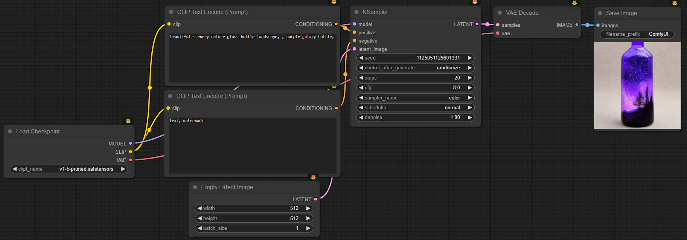

---

## What is a Checkpoint?

- **Model**: Pre-trained weights (SD 1.5: 860M, SDXL: 3.5B x2) for generating images, (the *Brain*)
- **CLIP** (Contrastive Language–Image Pretraining):  Convert text to **conditioning** (the *Instructions*)
- **VAE** (Variational Autoencoder):   Encode images from and to latent space (the *Canvas*)

Distributed as `.safetensor` files,
e.g. SD 1.5 (~2GB), SDXL 1.0 (~6GB)

---

## KSampler Options

- **Steps**: 
- **CFG**:
- **Sampler**: A sampling method used during the generation process to better refine and select the image outputs based on certain criteria or conditions. (e.g. Euler, DPM++2M)
- **Scheduler**: A mechanism that controls the rate and pattern at which noise is added or removed during the diffusion process. (e.g. Normal, [Karras](https://arxiv.org/abs/2206.00364))
- **Denoise**:

---

## Nodes

- ComfyUI Custom Nodes are peoples GitHub repos
- Auto install Python packages
- Can download models
- Models can contain code

Use Docker

---

## ComfyUI: Community Nodes

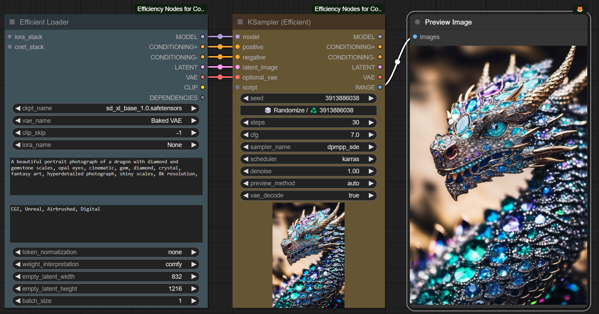

---

## ComfyUI: XY-Plots

---

## Community: [civit.ai](https://civitai.com/)

- User-Trained Checkpoints, LoRAs, 
- Images for Inspiration

---

## Juggernaut XL Lightning

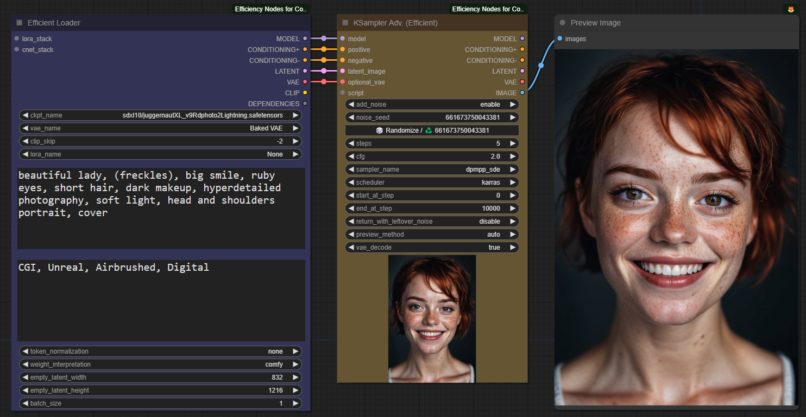

<!--
professional Portrait photo of Elon Musk in a black leather jacket in a cannabis plantation on planet Mars, red mountains in the background, black sky, inspirational, iconic, 8k, detailed, golden hour, beautiful day

a sports car made out of potatoes

car made out of croissants

closeup photo of an ice cream sundae in a glass with a cherry on top on a wooden dining table outside a small busy pedestrian shopping alley, beautiful sunny day, Florence, Italy, 
-->

---

# Prompting

---

## Prompting 101

- Just describe what you want
  - most models like "tags"
  - some newer methods like long descriptions
  - start with empty negative prompt
- Loads of wrong, old, or contradicting information
  - cargo cult: big blocks of negative prompts
  - `photorealism` does not mean `photo`
- Use Braces for emphasis (man) (handsome:1.5)
- Use prompt styler for easy great results

<!--
https://civitai.com/images/10236552
-->

---

## ComfyUI: Negative Prompts

---

## ComfyUI: Prompt Styler

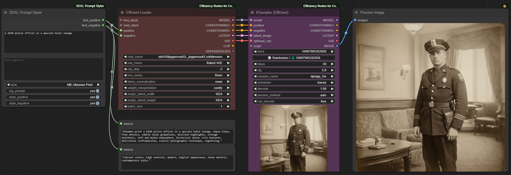

<!--
a ufo over a remote 1850 hamlet in the hills of west virginia, beaming up a cow
-->

---

## Guess The Prompt

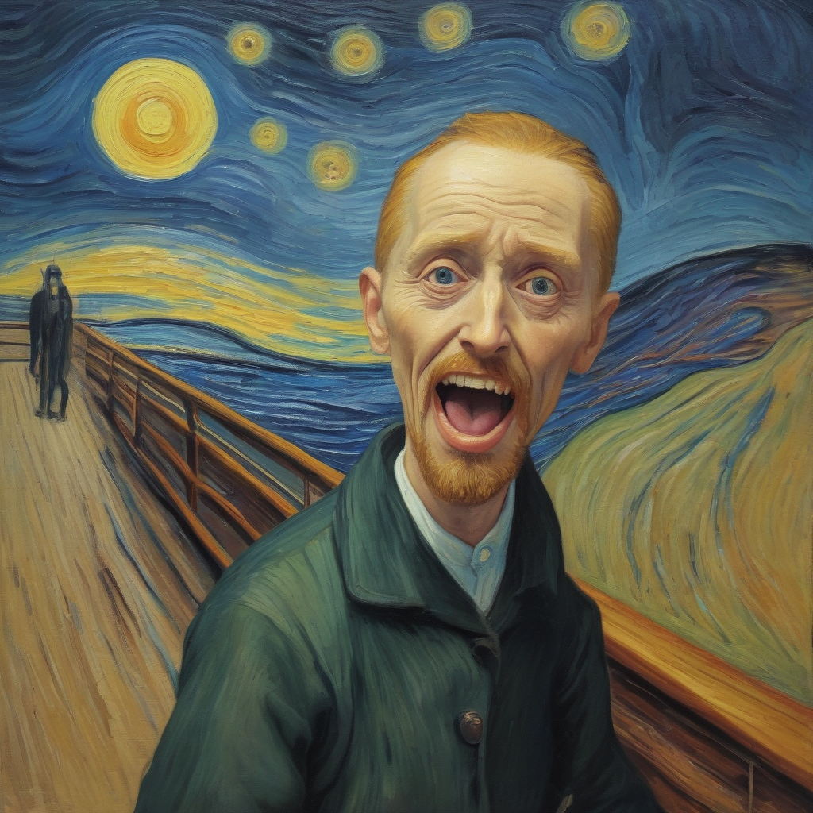
<!-- The Scream by Vincent van Gogh --> 

---

## Guess The Prompt

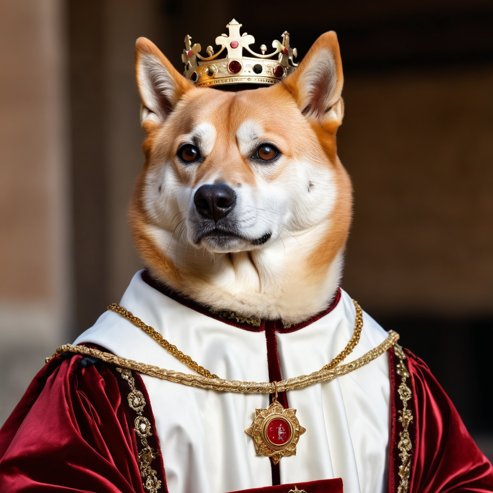
<!-- Doge of Venice --> 

---

# Techniques

- Tuning the Brain (Model)
- Clarifying the Instructions (Conditioning)
- Providing a pre-painted Canvas (Latent)

---

## LoRA (Low-Rank Adaptation)
  - technique for fine-tuning the model
  - effective addition of specific concepts
  - `.safetensor`, ~100MB
  - often react to specific keywords

---

## ComfyUI: LoRA

[Juggernaut XL](https://civitai.com/models/133005?modelVersionId=288982) + [Bricks Style](https://civitai.com/models/274576/bricks-style-sdxl) + [Fried Egg Style](https://civitai.com/models/255828/fried-egg-style-lora-15sdxl)

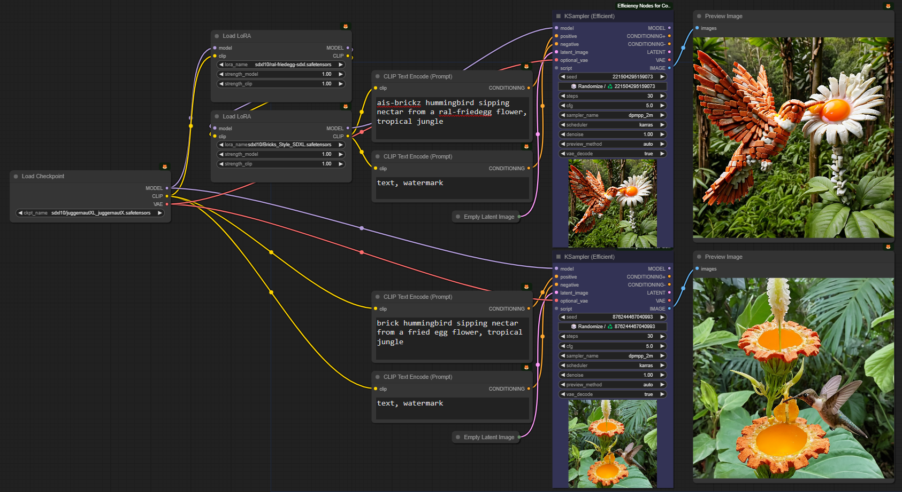

---

## ComfyUI: img2img (via Latent)

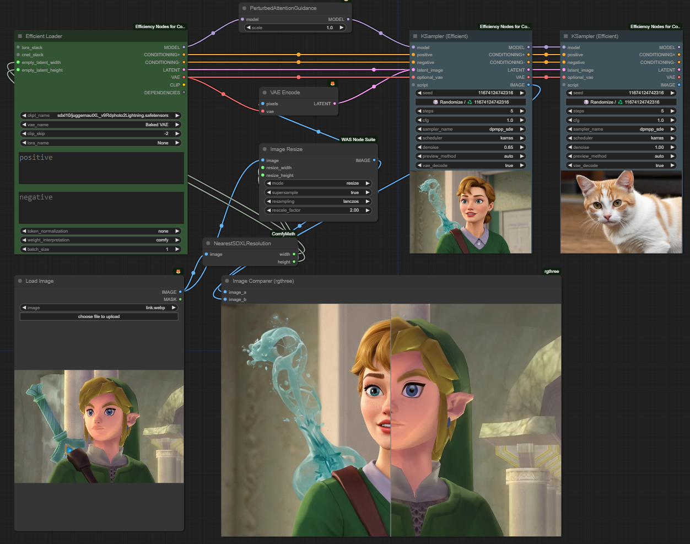

---

## ComfyUI: Upscale

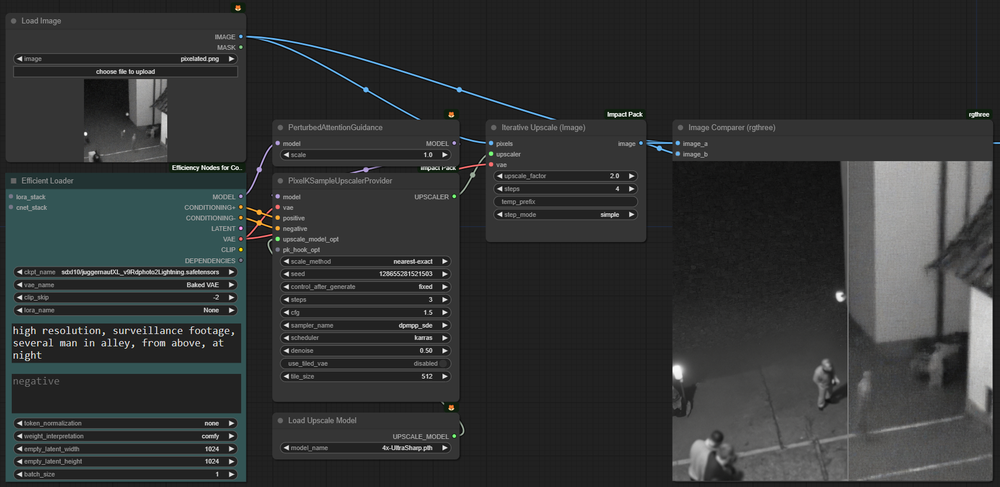

---

## ComfyUI: ControlNet Recolor

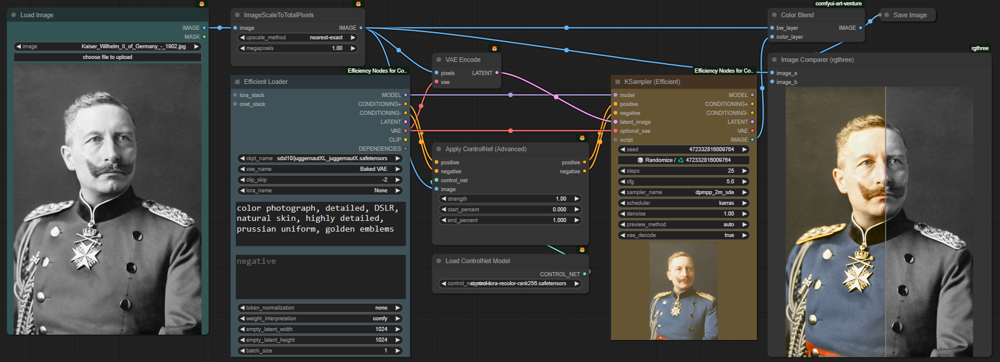

---

## ComfyUI: ControlNet [Poses](https://openposes.com/)

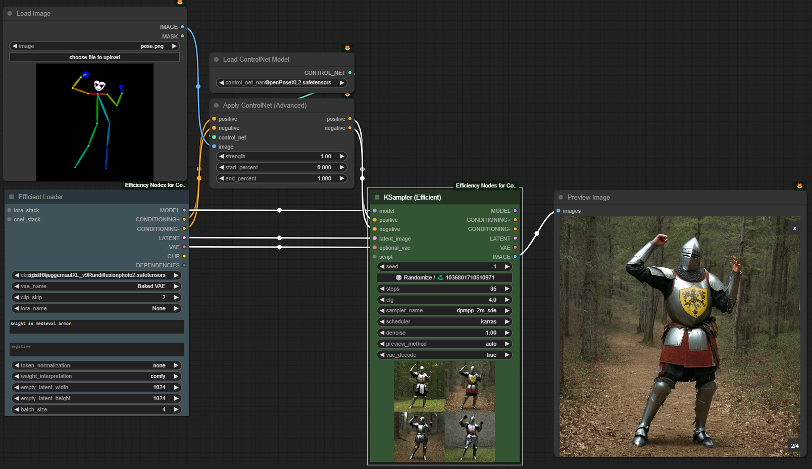

---

## ComfyUI: ControlNet DepthMap

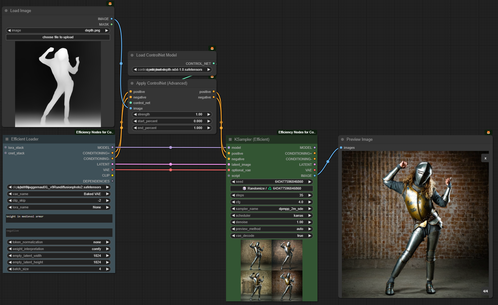

---

## How to draw an Owl

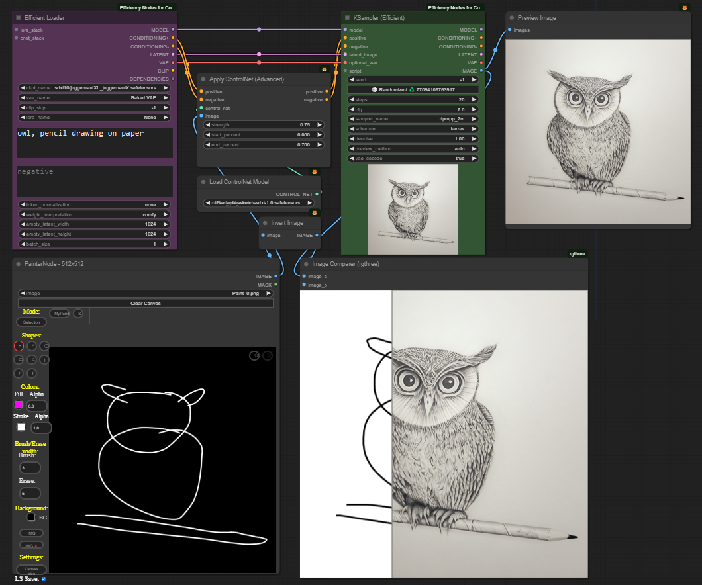

---

## ComfyUI: Preprocessors

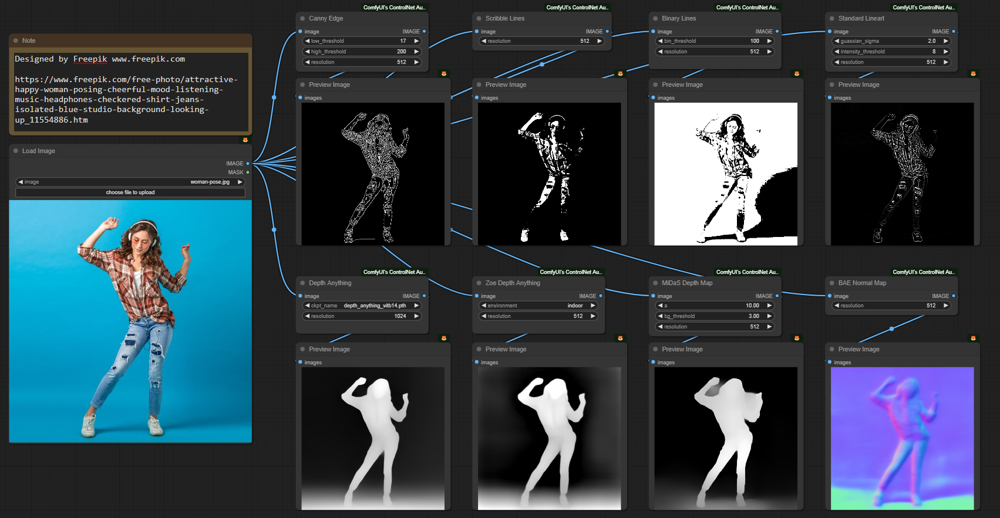

---

## ComfyUI: Preprocessors

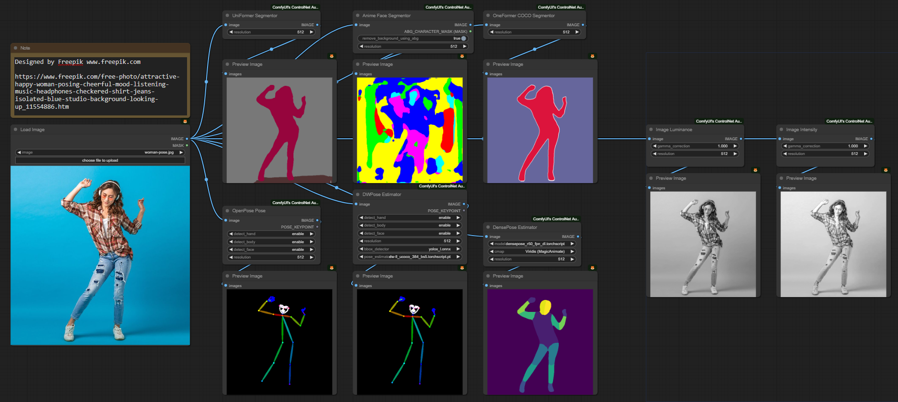

---

## ComfyUI: IP Adapter

<!--
Jacket
-->

---

## ComfyUI: Face ID

---

## ComfyUI: 3D

---

## ComfyUI: Video

---

## ComfyUI: Übertrieben

---

https://github.com/Acly/krita-ai-diffusion

---

## My Takeways

- Not easy, but a lot of fun
  - Many duds / fails, many reruns required. (RNGesus)
  - Worse than Midjourney, but Control is great
  - Problems: Lack of Imagination + PC
- SD 1.5 base model = 🔥 🗑
  - derivative models okay-ish
  - +Loras, +ADetailer, +HiRes Fix
- SDXL much better - and much slower
- Continue with ComfyUI

---

## Further Reading

Note: A lot of information is out of date or just wrong.

- https://civitai.com/
- https://www.reddit.com/r/StableDiffusion/
- https://www.youtube.com/@OlivioSarikas/videos
- https://medium.com/sogetiblogsnl/an-introduction-to-stable-diffusion-efd5da6b3aeb
- https://www.youtube.com/watch?v=1CIpzeNxIhU
- https://staffordwilliams.com/blog/2023/05/19/introduction-to-stable-diffusion/
