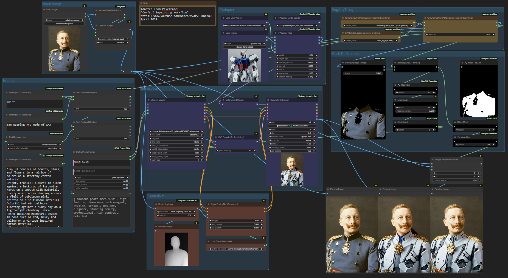
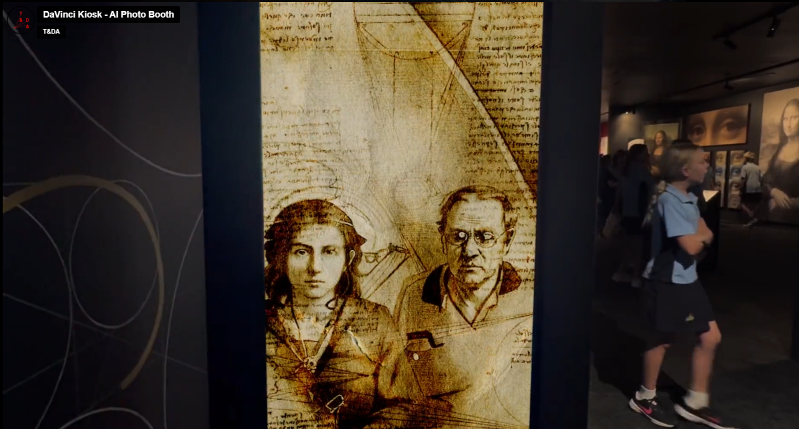
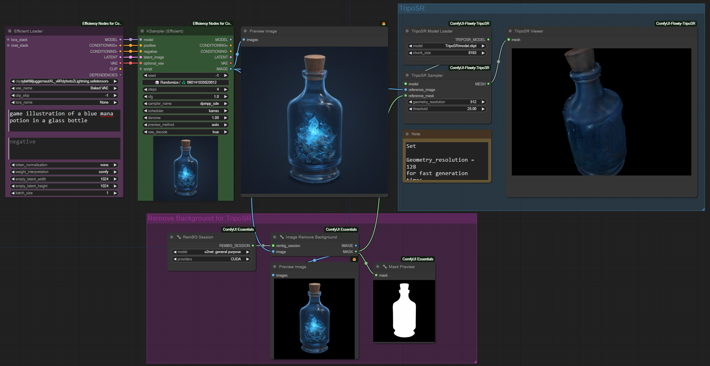
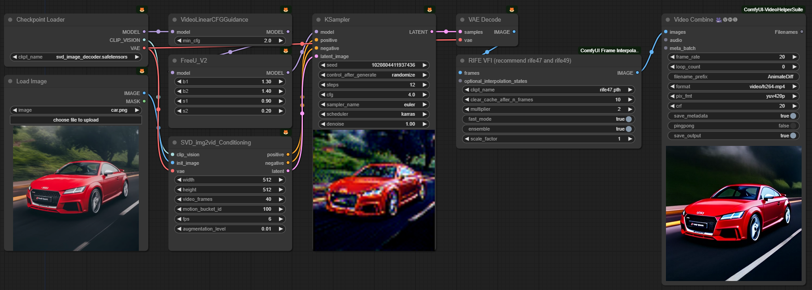

### A Not-Too-Deep Dive into   Image Generation with

# Stable Diffusion

Jan Mayer, 26.04.2024

---

## Stable Diffusion?

> Stable Diffusion is a [deep learning](https://en.wikipedia.org/wiki/Deep_learning), [text-to-image](https://en.wikipedia.org/wiki/Text-to-image_model) model released in 2022 based on [diffusion](https://en.wikipedia.org/wiki/Diffusion_model) techniques.

https://en.wikipedia.org/wiki/Stable_Diffusion

---

## Diffusion?

> ... involves training a neural network to sequentially [denoise](https://en.wikipedia.org/wiki/Denoise) images blurred with [Gaussian noise](https://en.wikipedia.org/wiki/Gaussian_noise). The model is trained to reverse the process of adding noise to an image.

https://en.wikipedia.org/wiki/Diffusion_model

<!--
Diffusion models are taught to remove noise from an image.
-->

---

## Learning Process

- Data Preparation: Images encoded into [latent space](https://en.wikipedia.org/wiki/Latent_space)
- Forward Diffusion (Noising):
  - Gradual addition of noise over a series of steps
  - Transforms the original into completely noisy state
- Model learns to reverse the diffusion process

---

## Generation

- Begin with random **noise** as input
- Reverse Diffusion (Denoising):
  - **Iteratively** applies the learned reverse process to the initial noise
  - At each step, the model predicts and subtracts the added noise, gradually denoising the data.
- **Conditioned** on text descriptions

Note: Deterministic with same settings + seed!

---

## Releases

| [Family](https://medium.com/@promptingpixels/comparing-stable-diffusion-models-2c1dc9919ab7)     | Release | Resolution |   |
|-----------:|--------:|------------| - |
| SD <1.5    | ~2022   |            | obsolete |
| [**SD 1.5**](https://huggingface.co/runwayml/stable-diffusion-v1-5) | Oct 22 | 512x512 | in use | 
| [SD 2.1](https://huggingface.co/stabilityai/stable-diffusion-2-1) | Nov 22 | 768x768 | obsolete |
| [**SDXL 1.0**](https://huggingface.co/stabilityai/stable-diffusion-xl-base-1.0) | Jul 23 | 1024x1024 | current |
| [Stable Cascasde](https://huggingface.co/stabilityai/stable-cascade) | Feb 24 | > 1024x1024 | research |
| SD 3.0 | ~2024 | | soon™ |

Variants: Inpainting, Turbo, Video, 3D ...

---

## Where to run it?

- Diffusion Process == Tensor Operations == Math
- [Graphics Card](https://geizhals.de/?cat=gra16_512&xf=10825_04+-+GeForce+RTX~132_16384&sort=p#productlist) required (VRAM ≫ everything else)
- Local:
    - RTX 4090 24GB (~1800€)
    - RTX 3090(Ti) 24GB (used: ~700€)
    - RTX 4060 Ti 16GB (~450€)
- Cloud: 
    - IaaS, e.g. [Azure VM with GPU](https://learn.microsoft.com/en-us/azure/virtual-machines/sizes-gpu) up to A100 cluster
    - PaaS, e.g. [rundiffusion](https://rundiffusion.com/) $.50/hr - UIs ready to use
    - SaaS, [many specialized](https://www.futuretools.io/?tags-n5zn=image-improvement%7Cgenerative-art%7Ctext-to-video%7Cgenerative-video), some free / credit-based

---

## How do I interact with it?

| UI | Reason to use | 
| -:|:- |
| [Scripts](https://huggingface.co/stabilityai/stable-diffusion-xl-base-1.0#%F0%9F%A7%A8-diffusers) | Tech Demo |
| [Fooocus](https://github.com/lllyasviel/Fooocus) | Easy to install and use, great results |
| [A1111](https://github.com/AUTOMATIC1111/stable-diffusion-webui) | Large userbase, many functions |
| [ComfyUI](https://github.com/comfyanonymous/ComfyUI) | Tinkering, create complex workflows |

> Wait, it's all Python? - Always has been.

---

## ComfyUI: Default Workflow

Images in this presentation contain workflows.
Drag and drop them into ComfyUI.

---

## What is a Checkpoint?

- **Model**: Pre-trained weights (SD 1.5: 860M, SDXL: 3.5B x2) for generating images, (the *Brain*)
- **CLIP** (Contrastive Language–Image Pretraining):  Convert text to **conditioning** (the *Instructions*)
- **VAE** (Variational Autoencoder):   Encode images from and to latent space (the *Canvas*)

Distributed as `.safetensor` files,
e.g. SD 1.5 (~2GB), SDXL 1.0 (~6GB)

---

## KSampler Options

- **Steps**: Number of iterations of the diffusion process
- **CFG**: Classifier-free guidance scale - how much the image generation process follows the conditioning
- **Denoise** / **Start at**: How much do keep of the given latent image (1.0 - full denoise, 0.0 - do nothing)

---

## KSampler Options

- **Sampler**: Obtains a sample from the model by subtracting estimated noise (e.g. `Euler`, `DPM++2M`)
- **Scheduler**: Controls the rate and pattern at which noise is added or removed (e.g. `Normal`, [`Karras`](https://arxiv.org/abs/2206.00364))

---

## ComfyUI: Community Nodes

---

## Nodes

- ComfyUI Custom Nodes are peoples GitHub repos
- Will auto install Python packages
- Can download models
- Models can contain code / excecutables

→ [Use Docker](./comfy/)

---

## ComfyUI: XY-Plots

---

## Community: [civit.ai](https://civitai.com/)

- User-Trained Checkpoints, LoRAs, ... 
- Images for Inspiration

---

## Juggernaut XL Lightning

<!--
professional Portrait photo of Elon Musk in a black leather jacket in a cannabis plantation on planet Mars, red mountains in the background, black sky, inspirational, iconic, 8k, detailed, golden hour, beautiful day

a sports car made out of potatoes

car made out of croissants

closeup photo of an ice cream sundae in a glass with a cherry on top on a wooden dining table outside a small busy pedestrian shopping alley, beautiful sunny day, Florence, Italy, 
-->

---

# Prompting

---

## Prompting 101

- Just describe what you want
  - most models like "tags"
  - newer methods like sentences
- Order matters, to some degree
- Use Braces for emphasis (man) (handsome:1.5)
- Use prompt styler for easy great results

<!--
https://civitai.com/images/10236552
-->

---

## What not to do

- Loads of wrong, old, or contradicting information
  - `photorealism` does not mean `photo`
  - Cargo Cult: big blocks of negative prompts, e.g. https://civitai.com/images/2263122
- Start with empty negative prompt
- Use negative prompts sparingly

---

## ComfyUI: Prompt Styler

See also https://mcradane.github.io/sdxl/, https://github.com/K3nt3L/MK-Styles

<!--
a ufo over a remote 1850 hamlet in the hills of west virginia, beaming up a cow
-->

---

## Guess The Prompt

<!-- The Scream by Vincent van Gogh --> 

---

## Guess The Prompt

<!-- Doge of Venice --> 

---

# Techniques

- Tuning the Brain (Model)
- Clarifying the Instructions (Conditioning)
- Providing a pre-painted Canvas (Latent)

---

## LoRA (Low-Rank Adaptation)
  - technique for fine-tuning the model
  - effective addition of specific concepts
  - `.safetensor`, ~100MB
  - often react to specific keywords

---

## ComfyUI: LoRA

[Juggernaut XL](https://civitai.com/models/133005?modelVersionId=288982) + [Bricks Style](https://civitai.com/models/274576/bricks-style-sdxl) + [Fried Egg Style](https://civitai.com/models/255828/fried-egg-style-lora-15sdxl)

---

## ComfyUI: img2img (via Latent)

---

## ComfyUI: Upscale

---

## ComfyUI: ControlNet Recolor

---

## ComfyUI: ControlNet [Poses](https://openposes.com/)

---

## ComfyUI: ControlNet DepthMap

---

## How to Draw an Owl

---

## ComfyUI: Preprocessors

---

## ComfyUI: Preprocessors

---

## ComfyUI: IP Adapter

<!--
Jacket
-->

---

## ComfyUI: Face ID

---

## "Usecase:" Item Change

---

## "Usecase:" Photo Booth

[AI Photo Booth: Drawn by da Vinci](https://www.t-da.io/work/da-vinci-ai-photo-booth/)

---

## ComfyUI: 3D

---

## ComfyUI: Video

---

<!--
https://github.com/Acly/krita-ai-diffusion

---
-->

## Further Reading

- https://huggingface.co/
- https://civitai.com/
- https://comfyworkflows.com/
- https://www.reddit.com/r/StableDiffusion/
- https://www.reddit.com/r/ComfyUI/
- https://www.youtube.com/@latentvision
- https://www.youtube.com/@OlivioSarikas

---

> We don't make mistakes, just happy little accidents.

 
 

- https://github.com/janmayer/talks/blob/master/stable-diffusion/stable-diffusion.md
- https://www.linkedin.com/in/dr-jan-mayer/
